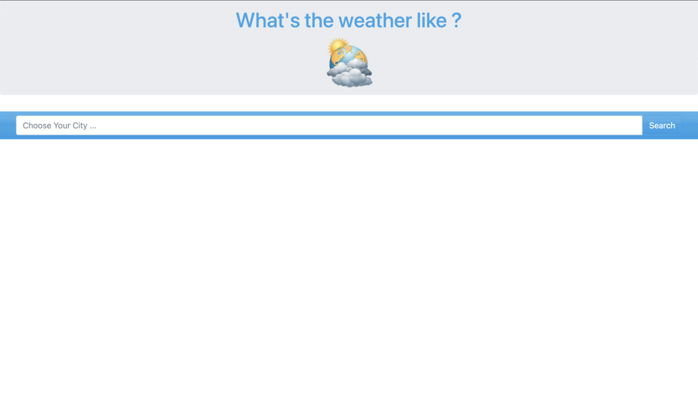

# Weather Project

<!--

-->

`weather_project` is a web application that allows users to check weather in various cities all around the world

<!--

-->

### Project Objective

+ To learn about using and integrating API into a web application development using Django

### What Did I Learn?

+ Using weather API to get current weather infomration and displaying it on the UI.
+ Handling bad requests when trying to get response from the weather API

### Future Changes

+ Add demo GIF
+ Add Heruko hosted live demo
+ Improve comments
+ Improve variable names